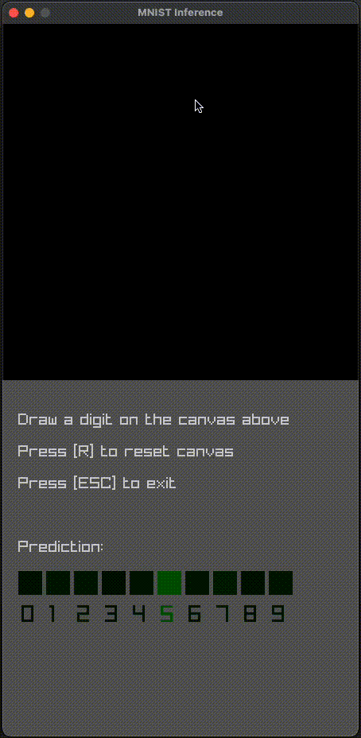

# MNIST in C

## Neural Networks + Raylib

MNIST Inference in pure C: A toy example app that lets you draw digits and predicts which number you drew using a neural network trained with TensorFlow. The inference code uses my other toy project [ctensor](https://github.com/am1tyadav/ctensor)



## Dependencies

- [Task](https://taskfile.dev) (Optional). If you don't want to use Task, you can see the list of raw commands in the [Taskfile](Taskfile.yml)
- Python~=3.10. I recommend creating a virtual environment with [Miniforge](https://github.com/conda-forge/miniforge)
- [CMake](https://cmake.org)
- C compiler

## Usage

## Without Task and Conda

```bash
# create a python virtual environment
python -m venv venv
# activate the environment
source venv/bin/activate
# install dependencies
python -m pip install -r requirements.txt
# train the model
python train.py
# generate build files
cmake -B ./cmake-build -S .
# build the app
cmake --build ./camke-build --target mnist_example
# run the app
./cmake-build/mnist_example
```

### With Task and Conda

Run all tasks with

```bash
task all
```

or one by one:

```bash
# setup conda environment for model training
task conda
# train the neural network on MNIST data
task train
# build the app
task build
# run the app
task run
```
